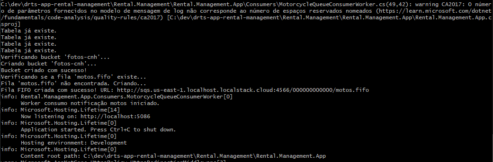
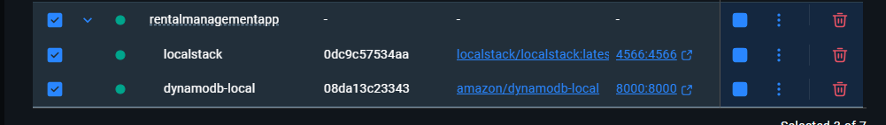
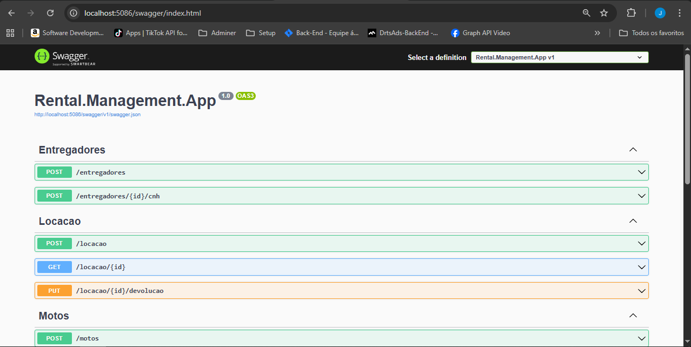

# drts-app-rental-management

Gestão de aluguel de motos e entregas

Passos para rodar localmente utilizando Docker

1 - Instalar o docker desktop

```bash
https://www.docker.com/products/docker-desktop/

```

2 - Na pasta Rental.Management.App rodar seguinte comando

```bash
docker compose up -d
```

3 - Rodar a aplicação

```bash
dotnet run
```

4 - Verificar a porta que estara em execução, devera ser a seguinte

```
http://localhost:5086/swagger/index.html
```

Observação: ao iniciar a aplicação será criado as tabelas(dynamodb), fila(sqs) e bucket(s3) no localstake simulando AWS.



Containers devera está em execução




